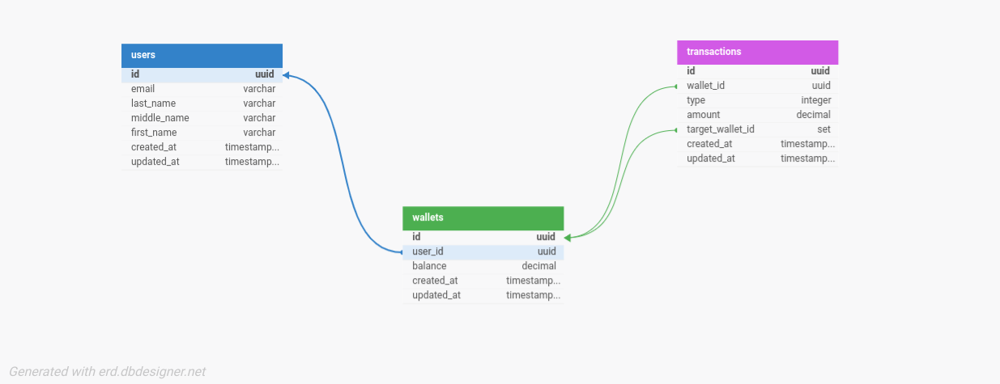

# Demo Credit Wallet Service API

## Table of Contents
- [Project Overview](#project-overview)
- [Tech Stack](#tech-stack)
- [Project Structure](#project-structure)
- [Setup and Installation](#setup-and-installation)
- [Database Schema](#database-schema)
- [API Endpoints](#api-endpoints)
- [Testing](#testing)
- [Deployment](#deployment)
- [Design Decisions](#design-decisions)
- [Security & Performance](#security--performance)

---

## Project Overview

The Demo Credit Wallet Service API is a backend application designed to provide wallet functionality for a lending application. This service allows users to create accounts, manage wallets, fund and withdraw from wallets, and transfer funds between users. The project also integrates with the Adjutor Karma blacklist API to prevent blacklisted users from onboarding.

This API is built with Node.js and TypeScript, following 12-factor app principles to ensure scalability, maintainability, and adherence to industry best practices.

---

## Tech Stack

- **Node.js (LTS)** - Backend runtime
- **TypeScript** - Static typing for maintainability
- **Express** - HTTP server for routing and middleware management
- **Knex.js** - SQL query builder and ORM for database operations
- **MySQL** - Relational database
- **Faker.js** - Generating realistic seed data for testing
- **Jest** - Testing framework for unit and integration tests

---

## Project Structure

The project follows a modular, feature-based structure inspired by NestJS, ensuring each feature (module) has its own controller, service, and model. Common utilities and configurations are managed separately to enable reusability and scalability.

```plaintext
### Project Structure

```plaintext
├── src
│   ├── config
│   │   ├── env.config.ts            # Environment variables configuration
│   │   ├── knex.ts                  # Knex database connection configuration
│   │   └── swagger.config.ts        # Swagger documentation configuration
│   ├── middleware
│   │   ├── fauxAuth.ts              # Faux authentication middleware
│   │   └── mockFauxAuth.ts          # Mock authentication for testing
│   ├── migrations                   # Database migrations for users, wallets, and transactions
│   ├── modules
│   │   ├── health                   # Health check endpoint
│   │   ├── shared
│   │   │   ├── interfaces           # Base interface for shared types
│   │   │   └── models               # Base models for shared entities
│   │   ├── transactions             # Transaction-related logic
│   │   ├── users                    # User-related logic
│   │   └── wallet                   # Wallet-related logic
│   ├── seeds                        # Database seed files for users and wallets
│   ├── tests                        # Root-level folder for end-to-end tests
│   ├── types
│   │   ├── express                  # Custom Express request types for authenticated user
│   │   └── custom.ts                # Custom type definitions
│   ├── utils                        # Utility functions (if needed)
│   ├── app.ts                       # Application entry point
│   └── server.ts                    # Server setup
├── jest.config.js                   # Jest testing configuration
├── knexfile.ts                      # Knex configuration file
├── README.md                        # Project documentation
├── roadmap.md                       # Project roadmap
└── tsconfig.json                    # TypeScript configuration
└── .env                         # Environment variables file (ignored in version control)
└── .env.sample                  # Sample environment file to guide developers on required variables
```

### Key Directories and Files

- **src/config**: Holds configuration files for setting up environment variables and Swagger documentation.
- **src/middleware**: Custom middleware for tasks like error handling and request validation.
- **src/migrations**: Database migrations managed by Knex.js, creating the necessary tables for `users`, `wallets`, and `transactions`.
- **src/modules**: Organized by feature, with each module encapsulating its own controllers, services, and models. This modular structure keeps the codebase clean and scalable.
  - **health**: Contains a health check endpoint for monitoring API status.
  - **transaction**: Handles all transaction-related operations, including transfers and transaction history.
  - **users**: Manages user-related operations like onboarding and validation.
  - **wallet**: Manages wallet operations such as creating wallets, funding, and balance checking.
- **src/seeds**: Seeder files for generating initial data to test the application in development environments.
- **tests**: Includes unit and integration tests to ensure API reliability.
- **app.ts**: Main app setup, defining middleware and routing.
- **server.ts**: Initializes and starts the Express server, applying the route prefix `/api`.

This structure ensures a scalable and maintainable architecture for developing a feature-rich API.
---

## Setup and Installation

### Prerequisites

- **Node.js** (version 14 or above)
- **MySQL** installed and running

### Environment Variables

Create a `.env` file at the root of the project:

```plaintext
# .env
PORT=3000
DATABASE_URL=mysql://<username>:<password>@localhost:3306/demo_credit
DATABASE_HOST=your_db_host
DATABASE_PORT=your_db_port
DATABASE_USER=your_db_user
DATABASE_PASSWORD=your_db_password
DATABASE_NAME=your_db_name
ADJUTOR_API_KEY=your_adjutor_api_key
```

### Steps to Install and Run

1. **Clone the Repository**:
   ```bash
   git clone https://github.com/LexxLuey/demo-credit.git
   cd demo-credit
   ```

2. **Install Dependencies**:
   ```bash
   npm install
   ```

3. **Set Up Database**:
   - Ensure MySQL is running and create a database named `demo_credit`.
   - Run migrations to create tables:
     ```bash
     npx knex migrate:latest --knexfile knexfile.ts
     ```

4. **Seed Database**:
   - Populate the database with dummy data for testing:
     ```bash
     npx knex seed:run --knexfile knexfile.ts
     ```

5. **Run the Application**:
   ```bash
   npm run dev
   ```
   The API will be available at `http://localhost:3000`.

---

## Database Schema

The database schema consists of three main tables: `users`, `wallets`, and `transactions`.



1. **Users**: Stores user information.
   - **Fields**: `id`, `first_name`, `middle_name`, `last_name`, `email`, `created_at`, `updated_at`
2. **Wallets**: Tracks each user’s wallet and balance.
   - **Fields**: `id`, `user_id` (foreign key), `balance`, `created_at`, `updated_at`
3. **Transactions**: Records all transactions, including fund, transfer, and withdrawal.
   - **Fields**: `id`, `wallet_id`, `type`, `amount`, `target_wallet_id`, `created_at`

---

## Authentication

This project implements a **faux token-based authentication** mechanism. The last created user in the database is considered the authenticated user for each request. This user information, including the user’s wallet ID, is attached to `req.authenticatedUser` by the `fauxAuth` middleware for all relevant endpoints.


## API Documentation

Swagger documentation for this API is available at `/api/docs`.

- **URL**: `http://localhost:3000/api/docs`
- This provides detailed information on each API endpoint, including request parameters, response formats, and example payloads.


## API Endpoints

### Health Check
- **GET `/health`**: Checks API health status.

### User and Wallet Operations

1. **User Onboarding**
   - **POST `/users`**: Creates a new user, ensuring the user is not blacklisted via Adjutor Karma API.
   - **Request**: `{ "first_name": "John", "middle_name": "Doe", "last_name": "Q", "email": "john@example.com" }`

2. **List Users**
   - **GET `/users?page=1&limit=10&search=john`**: Retrieves paginated and searchable list of users.
   - **Query Parameters**: `page` (default: 1), `limit` (default: 10, max: 100), `search` (optional)

3. **Fund Wallet**
   - **POST `/wallets/fund`**: Adds funds to a user’s wallet.
   - **Request**: `{ "amount": 1000 }`

3. **Transfer Funds**
   - **POST `/wallets/transfer`**: Transfers funds between users.
   - **Request**: `{ "receiverWalletId": "<wallet-id>", "amount": 200 }`

4. **Withdraw Funds**
   - **POST `/wallets/withdraw`**: Withdraws funds from a user’s wallet.
   - **Request**: `{ "amount": 500 }`

5. **Transaction History**
   - **GET `/wallets/transactions?&page=1&limit=10`**: Retrieves transaction history for a user’s wallet.

6. **Check Balance**
   - **GET `/wallets/balance`**: Returns the current wallet balance.

### Wallet Endpoints

- **GET /wallet** - Retrieve a paginated and searchable list of all wallets in the system.
  - **Query Parameters**:
    - `page` (number): Page number for pagination (default: 1).
    - `limit` (number): Number of wallets per page (default: 10, max: 100).
    - `search` (string): Search term to filter wallets by user name, email, or wallet ID.
  - **Response**:
    ```json
    {
      "data": [
        {
          "id": "wallet-id",
          "user_id": "user-id",
          "balance": 1500.75,
          "created_at": "2024-01-15T10:30:00.000Z",
          "updated_at": "2024-01-15T10:35:00.000Z",
          "user": {
            "first_name": "John",
            "last_name": "Doe",
            "email": "john.doe@example.com"
          }
        }
      ],
      "page": 1,
      "limit": 10,
      "total": 25
    }
    ```
  - **Error Responses**:
    - `500 Internal Server Error`: Database error or server issue.

- **POST /wallet/fund** - Fund the authenticated user's wallet with a specified amount.
  - **Request Body**:
    ```json
    { "amount": number }
    ```
  - **Response**:
    ```json
    { "message": "Wallet funded successfully", "balance": number }
    ```
  - **Error Responses**:
    - `401 Unauthorized`: User not authenticated or has no wallet.
    - `404 Not Found`: Wallet not found.

- **POST /wallets/transfer** - Transfer funds from the authenticated user's wallet to another wallet.
  - **Request Body**:
    ```json
    { "receiverWalletId": string, "amount": number }
    ```
  - **Response**:
    ```json
    { "message": "Transfer successful", "amount": number, "receiverWalletId": string }
    ```
  - **Error Responses**:
    - `401 Unauthorized`: User not authenticated or has no wallet.
    - `400 Bad Request`: Attempt to transfer to self, insufficient funds, or invalid wallet.

- **POST /wallets/withdraw** - Withdraw funds from the authenticated user's wallet.
  - **Request Body**:
    ```json
    { "amount": number }
    ```
  - **Response**:
    ```json
    { "message": "Withdrawal successful", "balance": number }
    ```
  - **Error Responses**:
    - `401 Unauthorized`: User not authenticated or has no wallet.
    - `400 Bad Request`: Insufficient funds.

- **GET /wallets/transactions** - Retrieve a paginated list of the authenticated user's transaction history.
  - **Query Parameters**:
    - `page` (number): Page number for pagination.
    - `limit` (number): Number of transactions per page.
  - **Response**:
    ```json
    { "data": [transactions], "page": number, "limit": number, "total": number }
    ```
  - **Error Responses**:
    - `401 Unauthorized`: User not authenticated or has no wallet.
    - `400 Bad Request`: Invalid wallet or retrieval error.

- **GET /wallets/balance** - Check the current balance of the authenticated user's wallet.
  - **Response**:
    ```json
    { "walletId": string, "balance": number }
    ```
  - **Error Responses**:
    - `401 Unauthorized`: User not authenticated or has no wallet.
    - `400 Bad Request`: Invalid wallet ID or balance retrieval error.

---

## Testing

The application includes unit and integration tests to ensure functionality and robustness.

### Run Tests

To run tests, use the following command:
```bash
npm test
```

### Testing Scenarios

- **Positive Test Cases**: Ensure all endpoints work as expected with valid data.
- **Negative Test Cases**: Test edge cases such as insufficient funds, invalid IDs, and blacklisted users.

---

## Deployment

1. **Hosting Platform**: The application can be deployed on Heroku or any other cloud provider. It currently finds its home on render.com
2. **Build for Production**:
   ```bash
   npm run build
   ```
3. **Deploy URL Structure**: Deploy using the URL format `https://lex-lutor-lendsqr-be-test.onrender.com`.

---

## Design Decisions

1. **Modular Structure**: Following NestJS-inspired modular structure keeps each feature (user, wallet, transaction) encapsulated, ensuring maintainability and scalability.
2. **12-Factor Principles**: Adhered to 12-factor app principles for environment configuration, logging, and database handling.
3. **Transaction Handling**: Used Knex transaction scoping to handle fund transfers and withdrawals atomically, ensuring data consistency.
4. **Error Handling**: Implemented centralized error handling with custom middleware, providing meaningful error responses for client requests.
5. **Adjutor Karma Blacklist API**: Integrated Adjutor Karma API during user onboarding to prevent blacklisted users from accessing the service.

---

## Security & Performance

- **Rate Limiting:** All API endpoints are protected with rate limiting (100 requests per 15 minutes per IP) to prevent abuse and ensure fair usage.
- **Structured Logging:** All logs use Winston for structured, production-grade logging. Sensitive data is never logged.
- **Centralized Error Handling:** All errors are handled by a global middleware, providing consistent error responses and logging.
- **Input Sanitization:** All user input and search queries are sanitized to prevent SQL injection and XSS attacks.
- **Environment Validation:** Startup validation ensures all required environment variables are present and valid, preventing silent misconfiguration.
- **Query Optimization:** All search and pagination queries use a shared query builder utility for DRY, efficient, and secure database access.
- **Database Indexes:** Frequently queried fields are indexed for optimal performance.

---

## Acknowledgments

This project was developed as part of an assessment for a backend engineering role at Lendsqr. It demonstrates core competencies in TypeScript, Node.js, MySQL, and scalable backend architecture practices.